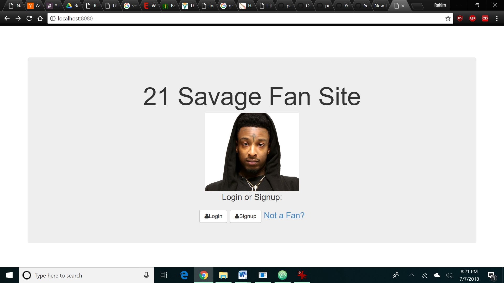

## Installation

1. Clone repo
2. run `npm install`

## Usage

1. run `node server.js`
2. Navigate to `localhost:8080`
21 Savage secure fan site

I wanted to make a secure site for 21 Savage fans that made users make an account and post their favorite song by 21 Savage. I added authorization to minimize the amount of trolls on this website.

Link to project:

How It's Made:
Tech used: HTML, CSS, Javascript, Node, Express, Mongo, Embedded Javascript, Passport

To control user login and signup I used the npm passport. After that I used Node and Express to create a server that my browser can connect to. After ensuring my server was up and running I created a form in Embedded Javascript that the user can input info to. After that I linked my Mongo database to the form so when information gets entered it also gets stored into the database.

Optimizations:
When the user logs in they get to see their profile info but I don't have an option for a profile picture i hope to eventually go back and add that.

Lessons Learned: I created an express server, learned to execute CRUD operations, save and read from MongoDB and I also learned to use a template engine like Embedded JS but for this project I used it more than I ever have. I have 6 Embedded JS files in this project compared to 1 Embedded JS file the past times i've used it. Even though it's similar to HTML there are slight differences and this project helped me learn some of those. Also in this project I tied the user vote to 1 counter. Before I had a counter for likes and a seperate counter for dislikes but now they are tied to one number.

Examples:
Take a look at these couple examples that I have in my own portfolio:

## Credit

Modified from Scotch.io's auth tutorial
